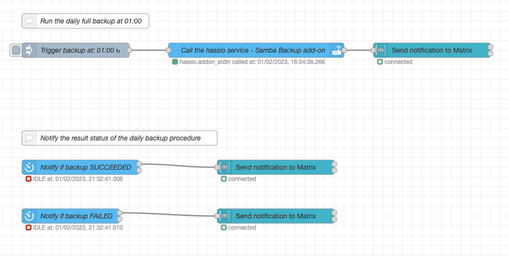
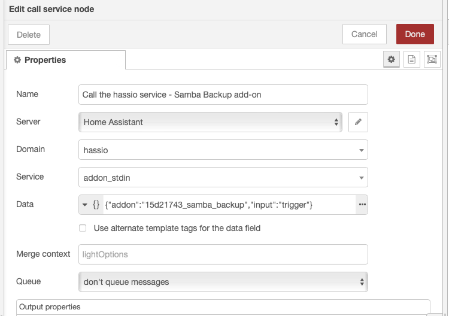

# Daily backups with offloading of backup files to NAS or any other device using `Samba Backup` add-on

Although my `Home Assistant` boots from SSD drive (attached using PCIe to IO board) with 512 GB of space, for doiong proper backups you have to offload backups to anothe location, another device. Yes, I am not the enterprise, but I do not want to rely on SSD drive. `Anything that can possibly go wrong, does.` - so doing proper backups is pretty important.

After couple of weeks of struggling to make a proper scripting setup, I find official add-on which definitely solved my biggest issue - copying backup to remote location using ewith Samba or secure transfer.

# Table of Contents

- [Basic idea and objectives](#basic-idea-and-objectives)
- [Key functionalities, highlights of the setup](#key-functionalities-highlights-of-the-setup)
- [Components](#components)
- [Procedure](#procedure)
  - [Remote location preparation - Samba share](#remote-location-preparation---samba-share)
  - [Samba Backup add-on installation and configuration](#samba-backup-add-on-installation-and-configuration)
    - [Samba Backup add-on configuration](#samba-backup-add-on-configuration)
    - [Samba Backup sensor state restore after `Home Assistant` reboot](#samba-backup-sensor-state-restore-after-home-assistant-reboot)
  - [Node-Red flow](#node-red-flow)
    - [Run the daily full backup](#run-the-daily-full-backup)
    - [Notify the result status](#notify-the-result-status)


# Basic idea and objectives

Plugin itself support automated backups trigerred at defined time, but I wanted to be notified if it run and what was the result. I use manual trigger and simple flow using `Node-Red`.

# Key functionalities, highlights of the setup

- manual trigger of backups
- simple flow trigerred at defined time
- notifications using `Matrix` service

# Components

**Hardware components:**

| Component | Link |
| --- | --- |
| Remote share with at least 10GB of free space | ... |

>**Note:**<br>In my case I used the `Raspberry PI 4B` which I use as DNS sinkhole on my home LAN. You can complain that the micro SDXC card used to run the `Raspberry OS` is not that reliable to SSD drive, but still is remote location. My plan is to use NAS in the future or external drive attached to my `Raspberry` device.

**Software components:**

| Software | Link |
| --- | --- |
| Samba Backup addon | [link](https://github.com/thomasmauerer/hassio-addons/tree/master/samba-backup) |
| Node-Red addon | [link](https://github.com/hassio-addons/addon-node-red) |

# Procedure

## Remote location preparation - Samba share

For those who are not familiar with LInux shell, please be carefull but still it's not a big deal to make this. Yes, the setup will not be the most secure. I assume you are managing your home LAN in proper way.

First, we need to install `samba` components on our device:

```bash
sudo apt install samba samba-common-bin -y
```

Create the folder which you want to use as root of your share. In my case I use `/home/share/`

```bash
sudo mkdir /home/share
```

Wait couple of seconds for the installation and continue with `smbd` configuration. Use your favourite editor in the shell (`vi`, `vim`, `nano`, `neovim`...):

```bash
sudo vi /etc/samba/samba.conf
```

Scroll down to the end of the file and put the following, adjusted configuration based on the folder and path you used in previous step:

```bash
[my_share]
path = /home/share
writeable=Yes
create mask=0777
directory mask=0777
public=no
```

Just hit the `ESCAPE` key, let `vi` to store and close the config - just type following `:wq!` + Enter. 

Then we can enable and start the `smbd` service:

```bash
sudo systemctl enable smbd.service && sudo systemctl start smdb.service
```

If everything is OK, you can check the service:

```bash
● smbd.service - Samba SMB Daemon
     Loaded: loaded (/lib/systemd/system/smbd.service; enabled; vendor preset: enabled)
     Active: active (running) since Mon 2023-01-02 14:09:43 CET; 7h ago
       Docs: man:smbd(8)
             man:samba(7)
             man:smb.conf(5)
    Process: 2648 ExecStartPre=/usr/share/samba/update-apparmor-samba-profile (code=exited, status=0/SUCCESS)
   Main PID: 2649 (smbd)
     Status: "smbd: ready to serve connections..."
      Tasks: 4 (limit: 4915)
        CPU: 45.367s
     CGroup: /system.slice/smbd.service
             ├─2649 /usr/sbin/smbd --foreground --no-process-group
             ├─2652 /usr/sbin/smbd --foreground --no-process-group
             ├─2653 /usr/sbin/smbd --foreground --no-process-group
             └─2654 /usr/sbin/smbd --foreground --no-process-group
```

Now we need to create user account which we will use to login remotely to samba. To create user we will create usual Linux user and set password for Samba.

Create user in the linux is easy - my user is `habackup`:

```bash
sudo useradd -M habackup
```

Now we can set the Samba password for the user:

```bash
sudo smbpasswd -a habackup
```

You will be asked to provide password for the user and retyping the same password for verification. Now we can move on.

## Samba Backup add-on installation and configuration

Installation of `Samba Backup` add-on is pretty simple - just follow the official installation [procedure here](https://github.com/thomasmauerer/hassio-addons/tree/master/samba-backup#installation). THere is also configuration section so you can continue there or check my instructions.

### Samba Backup add-on configuration

Here is my setup (yaml config):

```yaml
host: DNS_or_IP_address
share: pishare
target_dir: homeassistant-backups
username: habackup
password: __MY-SECRET-REDACTED-PASSWORD__
keep_local: "30"
keep_remote: "14"
trigger_time: manual
trigger_days:
  - Mon
  - Tue
  - Wed
  - Thu
  - Fri
  - Sat
  - Sun
exclude_addons: []
exclude_folders: []
backup_name: "{type} Backup {version} {date}"
log_level: debug
compatibility_mode: false
```

Adjust the config as you need and start the addon.

### Samba Backup sensor state restore after `Home Assistant` reboot

I recommend to follow official documentation - importing automation blueprint and setting automation.

## Node-Red flow



The flow contains two main parts - it's straight forward and very simple:
- Run the daily full backup at 01:00
- Notify the result status of the daily backup procedure

### Run the daily full backup

Backup is trigerred at 01:00 (CEST) - 1.00am - every day. I call the hassio service via API call:



You only need to define `Domain`, `Service` and `Data`. 

### Notify the result status

`Samba Backup` reports its status to specific sensor - `sensor.samba_backup`. I poll the sensor state every 5 seconds and waiting for certain statuses:
- SUCCEEDED
- FAILED

When backup procedure reports its status, flow will send a message using `Matrix` messenger about the result of the backup procedure. Pretty easy, and useful.
