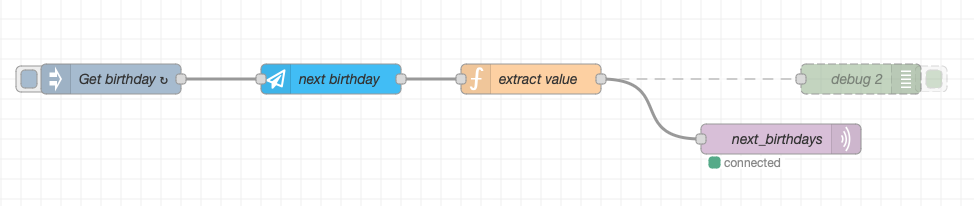

# Who is next having a birthdays?

I wanted to have a simple sensor showing next lucky person to have bitrhday party. I was struggling because there was no really smooth and easy integration so I started my small research and setup.

## Components

You need to use `HACS` custom component -> thanks to [Magnus Larsson(@Miicroo)](https://github.com/Miicroo) and his [ha-birthdays](https://github.com/Miicroo/ha-birthdays) add-on. For the setup, configuration and usage please refer to the documentation. It's very easy to use.

I utilize `MQTT` for posting custom messages and creating custom sensors in `configuration.yml`.

Last part which I use is `Node-Red`. 

# How to....

Although the `ha-birthdays` is very nice add-on, I was struggling to show "upcoming birthdays" - showing who is next...

## Birthdays list

I added all relevant persons which I have in the family (quite a lot...). The `ha-birthdays` addon calculates age of each person and number of days until their birthdays. The add-on is providing sensor `sensor.next_birthday` which have a state value - number of days until closest birthday and attributes with name and age of the person. I wanted to have simple sensor which will show name and age for upcoming birthday - something like `Name (Age)`.

## Node-Red flow

Following procedure is not the only one how to get a sensor as I wanted. For me, this was the easiest (sort of).

The flow looks like:



Every day, at 17:00 (5:00pm) it polls data from `sensor.next_birthday`. Extracts attributes from `json` and post the result as a new json to `MQTT` (custom topic).

The final `json` is posted to the following MQTT topic `birthdays/next_birthdays`. We will need it for configuring `MQTT` sensor in next step.

>Before setting sensor in your Homeassistant configuration please trigger first node `Get birthday` manually. This ensure that Homeassistant can parse the value from broker and wil not shout with any errors in log files.

## Sensor setup

Since `Homeassistant` have a native option to setup sensor from `MQTT` topics, I use it quite often... Here it is:

```yaml
mqtt:
  sensor:
  - name: "Narodeniny"
      unique_id: "birthdays"
      state_topic: "birthdays/next_birthdays"
      value_template: "{{ json_value.next-birthday' }}"
```

Reload your configuration under `Developer tools` or reboot your Homeassistant instance. You will find new sensor under `Entities`.

# Result

Finally you can put the sensor values to your instance homepage or any other Lovelace card. I use this on the e-ink display (like namedays).
