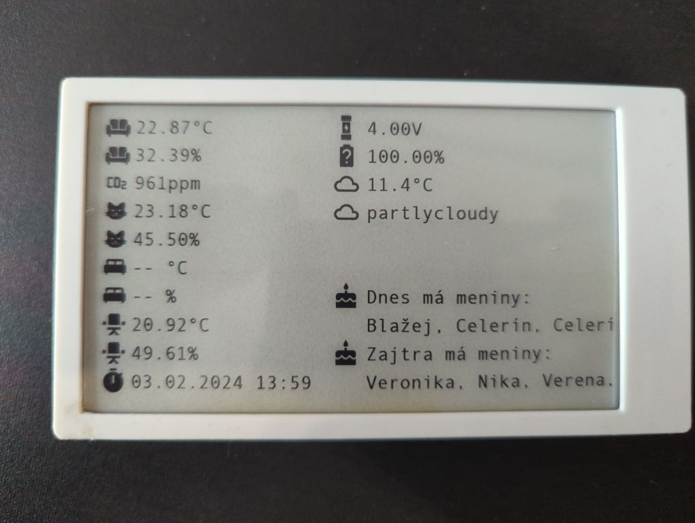
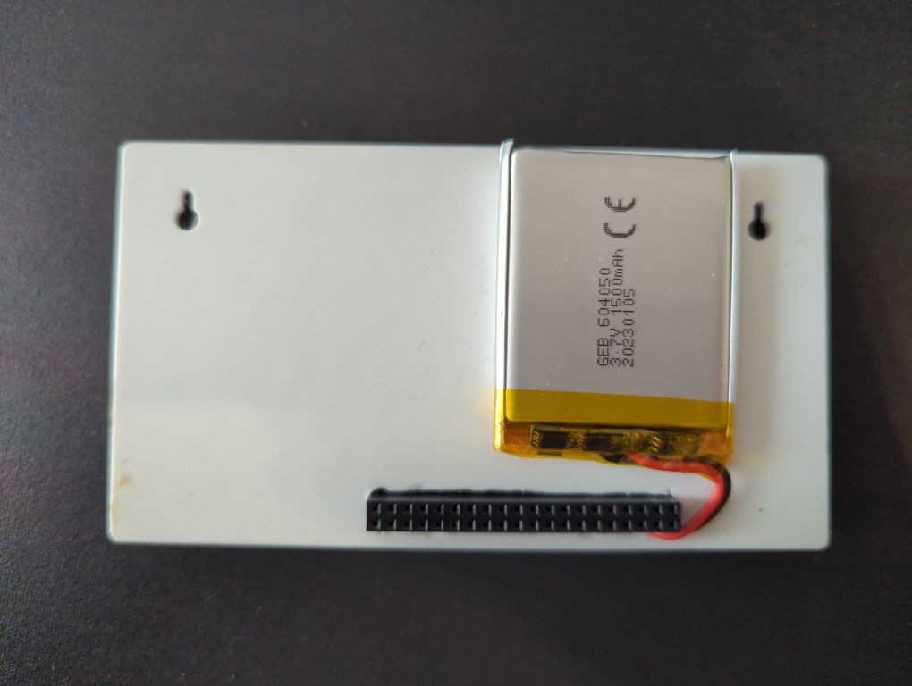

# Simple status display using eink Lilygo EPD47 unit

I have couple of sensors placed in my appartment measuring room temperature, humidity, CO2 and particles. I added all those data to `Home Assistant` dashboard but wanted to present the data for anybody at home also who does not use the mobile app.




Check the code inside the [code](./code/) folder.

# Basic idea and objectives

Some years ago freind of mine prepared similar device for his purpose - simple meteo dashboard showing actual weather and precipation from home sensors. I came to idea to use the concept and present measurements for anybody. 

# Key functionalities, highlights of the setup

- Periodical data fetch from `Home Assistant` API and display outcome on eink display
- Wireless operation - no power cable, utilizing 18650 battery and custom case
- Measuring estimated remaining battery capacity
  
# Components

All listed components are easy to obtain and available on many eshops. Of course, you need to have working `Home Assistant` box/instance in order to utilize and extent the functionalities as you want.

| Component | Link |
| --- | --- |
| LilyGO TTGO T5-4.7" E-Paper ESP32-S3 | [Laskakit.cz](https://www.laskakit.cz/lilygo-ttgo-t5-4-7--e-paper-esp32-wifi-modul/) |
| LiPol battery unit | [Laskakit.cz](https://www.laskakit.cz/ehao-lipol-baterie-603048-900mah-3-7v/) |

**Software components:**

Here are main software components which I used for inspiration about the concept and some of them are necessary for the operation (see includes in code).

| Software | Link |
| --- | --- |
| Weather station | [Github.com](https://github.com/Xinyuan-LilyGO/LilyGo-EPD-4-7-OWM-Weather-Display) |
| PubSubClient by [Nick O'Leary](https://twitter.com/knolleary) for MQTT | [knolleary.net](https://pubsubclient.knolleary.net)<br>[Github.com](https://github.com/knolleary/pubsubclient) |
| Arduino_JSON | [Github.com](https://github.com/arduino-libraries/Arduino_JSON) | 
| NTP library for Arduino framework | [Github.com](https://github.com/sstaub/NTP) |

# Fetching values from Homeassistant

This was quite straight forward. I use `Rest API` of the `HomeAsisstant` to get latest state values from sensors which I want to show results from. The `API endpoints` are defined in variables with `req_` prefix. See example:

```c++
//OFFICE
const char *req_temp_office = "http://__IP__:8123/api/states/sensor.hb_office_space_temperature";
const char *req_hum_office = "http://__IP__:8123/api/states/sensor.hb_office_space_humidity";

//BEDROOM
const char *req_temp_bedroom = "http://__IP__:8123/api/states/sensor.sonoff_a4800539db_temperature";
const char *req_hum_bedroom = "http://__IP__:8123/api/states/sensor.sonoff_a4800539db_humidity";
```

Don't forget to use your own endpoints.

# `httpGETRequest` - adjust the bearer token

Don't forget to add your own `API` token for authentication against `Homeassistant`. Just replace `__BEARER_TOKEN__` with your own token:

```c++
http.addHeader("Authorization", "Bearer __BEARER_TOKEN__");
```

The method returns `JSON` payload as string.

# 3D printed case

Since the ESP32-S3 board is not very often used, it was tricky to find proper 3D model for this board. However, I found one [here](https://www.printables.com/model/522518-lilygo-t5-47-s3-e-paper-case). Be aware that battery will not fit inside as well as soldered GPIO head. 

# Image convertion (Material Design Icons)

For converting images (Material Design Icons) I use `imgconvert.py` script available [here](https://github.com/Xinyuan-LilyGO/LilyGo-EPD47/blob/master/scripts/imgconvert.py). Just be aware that you have to use jpg file format for conversion. The png format with trasnparency is not properly converted.

# Dynamic refresh time based on time of the day

Original code did not funtion as expected so I reverted back to setting 15 minutes refresh time. I need to sort this out.